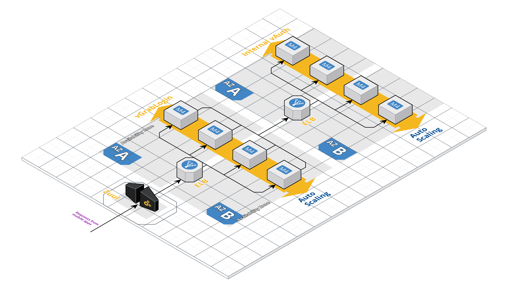

## From Monolith to Microservices

These are my old designs on how to break down a monolith into microservices but unfortunately, they were never implemented.

### Serving and Caching Images

### Scaling Up a Previously-Single Instance

### Decoupling Marketing Emails

### Decoupling Tweets

### Decoupling Push Notifications

### Scaling Up URL Signing

### Scaling Up Authentication

### Scaling Up Package Purchasing

### Improving Profile Management

### Simplifying the Workhorse's Job

### Decoupling User Count Service

